# Brain Extraction

Brain extraction removes nonbrain tissue from head images.

## Scalp removal

Most neuroimaging pipelines remove signal from the scalp, skull, and other nonbrain tissues. Brain extraction can improve registration and restrict subsequent analyses to the brain.

FSL BET established a widely used conventional approach. SynthStrip later introduced robust, modality-agnostic extraction using deep learning. SynthStrip benefits from NVIDIA GPU acceleration but can be slow when restricted to a CPU.

Brainchop provides a smaller model that runs through WebGPU on supported Apple, AMD, Intel, and NVIDIA hardware. A [browser demo](https://brainchop.org/) is available. The lighter mindgrab model is optimized for CPU execution, which can be useful when a pipeline must reserve GPU resources for other tasks. niimath includes the CPU-based mindgrab model.

<!-- figure-tsv: benchmark-mindgrab.tsv -->

## Links

- Iglesias et al. [(2011)](https://pubmed.ncbi.nlm.nih.gov/21880566/) evaluate established methods and introduce ROBEX.
- Hoopes et al. [(2022)](https://pubmed.ncbi.nlm.nih.gov/35842095/) describe SynthStrip.
- Fani et al. [(2026)](https://pubmed.ncbi.nlm.nih.gov/42331200/) introduce MindGrab, a lightweight Brainchop model trained with SynthStrip-derived images.
- Smith [(2002)](https://pubmed.ncbi.nlm.nih.gov/12391568/) describes BET.
- [FSL BET](https://fsl.fmrib.ox.ac.uk/fsl/docs/structural/bet.html) software (institutional license).
- [brainchop mindgrab](https://github.com/neuroneural/brainchop-cli) source code (permissive MIT license).
- [SynthStrip code and training data](https://surfer.nmr.mgh.harvard.edu/docs/synthstrip/).
