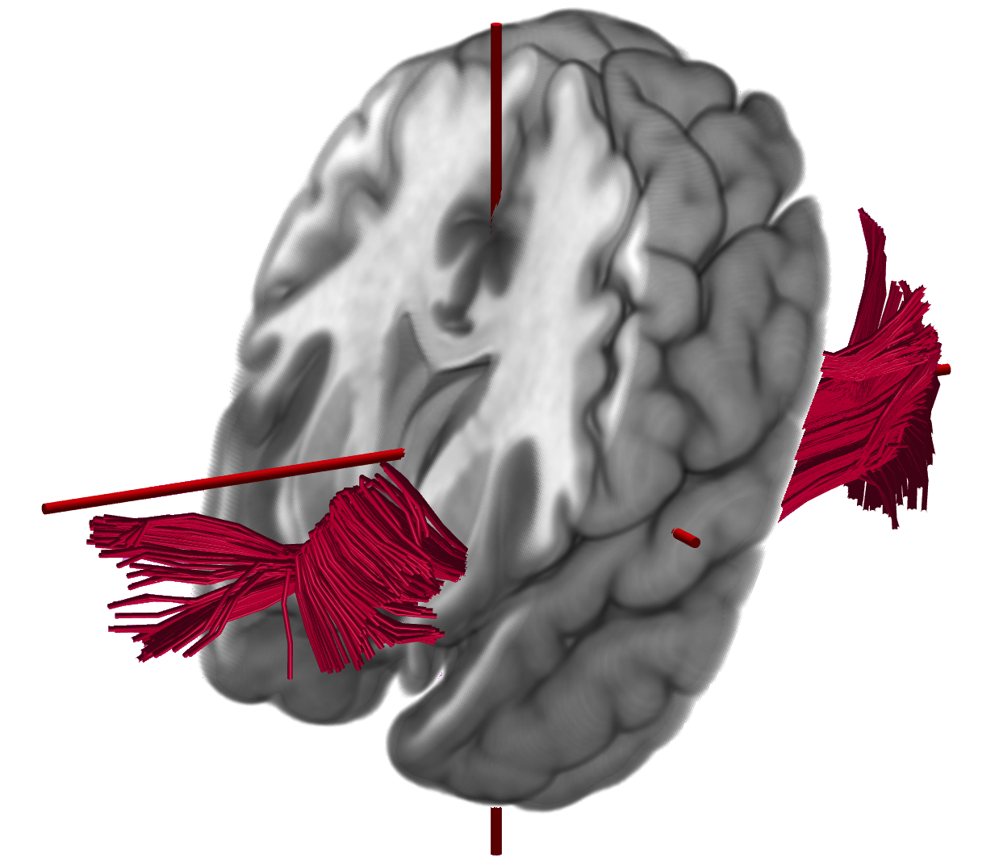

# Diffusion Imaging

light`nii`ng accelerates diffusion MRI processing and tractography across CUDA, Metal, and WebGPU.

## Diffusion processing

Diffusion MRI preprocessing is computationally intensive. [DiffusionBench](https://github.com/neurolabusc/DiffusionBench) demonstrates a representative workflow built from FSL tools. Several stages—including MMORF, `probtrackx2_gpu`, `bedpostx_gpu`, and `eddy_cuda`—provide CUDA implementations and therefore perform best on NVIDIA GPUs. Without a compatible NVIDIA GPU, these operations can be more than an order of magnitude slower.

The light`nii`ng team has optimized these tools to run up to twice as fast on NVIDIA GPUs and added Metal implementations for Apple silicon. Many FSL tools divide computation between the CPU and GPU rather than running entirely on the GPU. Apple’s unified-memory architecture allows both processors to access the same memory, avoiding transfers between separate CPU and GPU memory pools. Download our optimized version from [Github](https://github.com/neurolabusc/fsl-metal/releases).

<!-- figure-tsv: benchmark-fsl.tsv -->

> [!NOTE]
> Unlike other light`nii`ng software, these modified FSL tools retain the institutional FSL license. The optimized probabilistic methods are functionally equivalent to their reference implementations but may not produce numerically identical results.

## Streamline generation

[DIPY GPUStreamlines](https://github.com/dipy/GPUStreamlines/) generates tractography streamlines from voxelwise diffusion models. Its original CPU and CUDA backends provide substantial acceleration on NVIDIA hardware. light`nii`ng extends GPUStreamlines with Metal support for Apple hardware and WebGPU support across modern GPU vendors and browsers. The [browser demonstration](https://tee-ar-ex.github.io/dwi2trx/) provides a local, drag-and-drop workflow that processes diffusion data within the browser.

<!-- figure-tsv: benchmark.tsv -->

> [!NOTE]
> GPU speedups are measured against the CPU in each system. The Linux CPU completed the benchmark in 783 seconds; the Apple CPU required 894 seconds.

## References

- Lange et al. [(2024)](https://pubmed.ncbi.nlm.nih.gov/39712347/) introduce MMORF.
- Garyfallidis et al. [(2014)](https://pubmed.ncbi.nlm.nih.gov/24600385/) describe the DIPY software library.
- Hernández-Fernández et al. [(2013)](https://pubmed.ncbi.nlm.nih.gov/23658616/) introduce GPU acceleration for FSL BedpostX.
- Hernández-Fernández et al. [(2019)](https://pubmed.ncbi.nlm.nih.gov/30537563/) describe GPU-accelerated FSL ProbtrackX.
- Andersson et al. [(2003)](https://pubmed.ncbi.nlm.nih.gov/14568458/) describe the basis of FSL TOPUP.
- Andersson and Sotiropoulos [(2016)](https://pubmed.ncbi.nlm.nih.gov/26481672/) describe the framework used by FSL EDDY.
