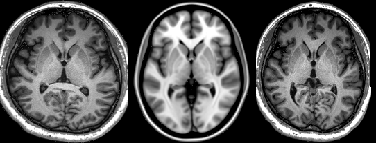
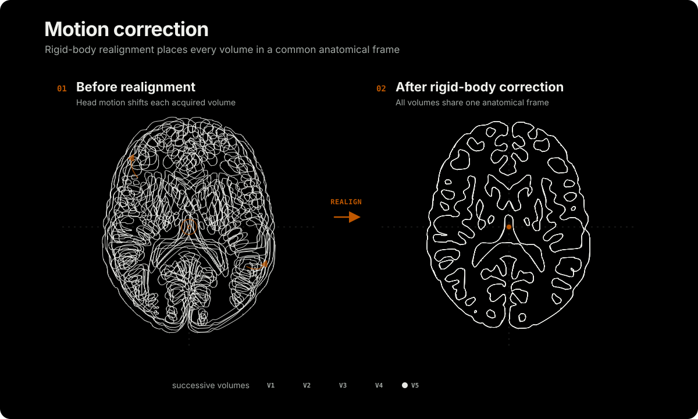

# Spatial Processing

Spatial preprocessing aligns neuroimaging data across modalities, sessions, and participants.

## Linear coregistration

Linear coregistration aligns images from different modalities, sessions, or participants. Affine registration estimates translation, rotation, scaling, and shear in three dimensions. Nonlinear registration may be needed when anatomical differences cannot be represented by an affine transform.

niimath provides an optimized implementation of AFNI's [3dAllineate](https://afni.nimh.nih.gov/pub/dist/doc/program_help/3dAllineate.html), with features informed by FSL FLIRT and SPM Coregister. It supports contrasts including T1- and T2-weighted MRI. The implementation is tuned for the adult human brain and is not intended for other anatomical regions or species. A WebAssembly [demo](https://www.edgereg.org/) runs entirely in the browser.

<!-- figure-tsv: benchmark-coreg.tsv -->

## Motion correction

Head motion during functional MRI (fMRI) introduces spatial misalignment between volumes. This can produce spurious voxel-wise intensity changes and spin-history artifacts. [Motion correction](https://andysbrainbook.readthedocs.io/en/latest/fMRI_Short_Course/Preprocessing/Motion_Correction.html), also called spatial realignment, models the head as a rigid body and estimates translation and rotation. lightNIIng accelerates AFNI's 3dvolreg while preserving functional equivalence.

<!-- figure-tsv: benchmark-moco.tsv -->

## Links

- [Cox (1996)](https://pubmed.ncbi.nlm.nih.gov/8812068/) describes the core features of AFNI.
- [Cox and Jesmanowicz (1999)](https://onlinelibrary.wiley.com/doi/10.1002/(SICI)1522-2594(199912)42:6%3C1014::AID-MRM4%3E3.0.CO;2-F) introduce 3dvolreg.
- [Saad et al. (2009)](https://pubmed.ncbi.nlm.nih.gov/18976717/) describe a local Pearson correlation cost function.
