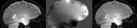
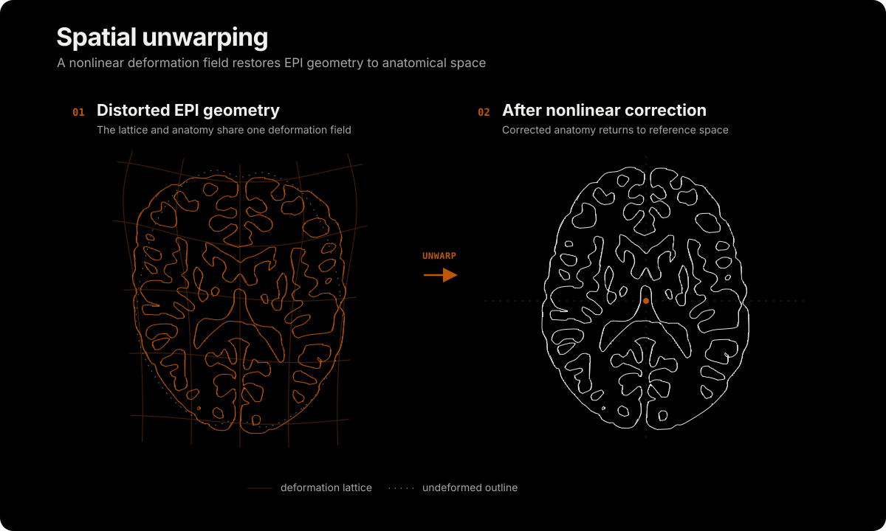

# Spatial Unwarping

Echo-planar imaging (EPI) enables rapid functional imaging but introduces spatial distortion. Unwarping methods estimate and correct this distortion.

## Multi-echo correction

Partial Fourier acquisition and in-plane acceleration can reduce EPI distortion, but may also reduce signal-to-noise ratio and do not eliminate distortion. Common correction methods use a separately acquired field map, as in [FSL FUGUE](https://fsl.fmrib.ox.ac.uk/fsl/docs/registration/fugue.html), or images with reversed phase encoding, as in [FSL TOPUP](https://fsl.fmrib.ox.ac.uk/fsl/docs/diffusion/topup/index.html).

Van et al. ([2026](https://pubmed.ncbi.nlm.nih.gov/42232073/)) introduced frame-wise Multi-Echo DIstortion Correction (MEDIC). MEDIC estimates field maps from phase data acquired as part of a multi-echo sequence. It requires no separate distortion-correction scan and estimates a field map for every volume, making the correction responsive to head motion.

The MEDIC authors provide the reference implementation in [warpkit](https://github.com/vanandrew/warpkit). niimath provides a compact, high-performance implementation through its `-medic` function.

<!-- figure-tsv: benchmark-medic.tsv -->

## Links

- [Dymerska et al.](https://pubmed.ncbi.nlm.nih.gov/33104278/) describe Rapid Open-source Minimum spanning treE algOrithm (ROMEO) phase unwrapping.
- [Van et al. (2026)](https://pubmed.ncbi.nlm.nih.gov/42232073/) introduce Multi-Echo DIstortion Correction (MEDIC).
- [ROMEO.jl](https://github.com/korbinian90/ROMEO.jl) provides Julia source code under the permissive MIT license.
- [warpkit](https://github.com/vanandrew/warpkit) provides C and Python code for MEDIC under a Washington University license that permits noncommercial use.
