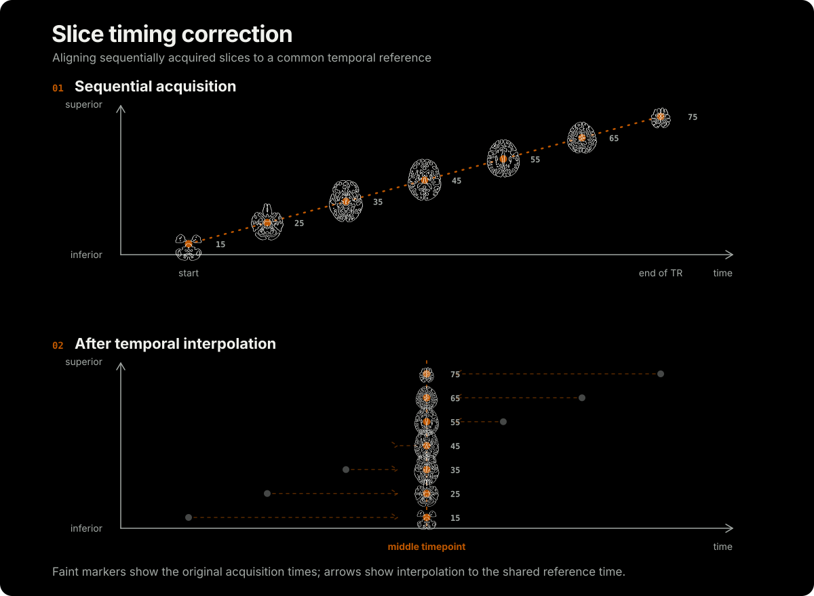

# Temporal Processing

Temporal preprocessing accounts for differences in when neuroimaging signals are acquired.

## Slice-timing correction

Echo-planar imaging (EPI) commonly acquires functional MRI (fMRI) as a sequence of two-dimensional slices. Slices within each repetition time (TR) therefore have different acquisition times, whether the order is ascending, descending, or interleaved. Slice-timing correction uses temporal interpolation, typically sinc or spline interpolation, to resample each blood-oxygen-level-dependent (BOLD) time series to a common reference time. This improves temporal alignment across slices before modeling.

light`nii`ng accelerates AFNI's 3dTshift while preserving functional equivalence.

<!-- figure-tsv: benchmark-stc.tsv -->

## Links

- [Cox (2013)](https://pmc.ncbi.nlm.nih.gov/articles/PMC3246532/) reviews core AFNI features.
- [Sladky et al. (2011)](https://pubmed.ncbi.nlm.nih.gov/21757015/) evaluate slice-timing correction.
