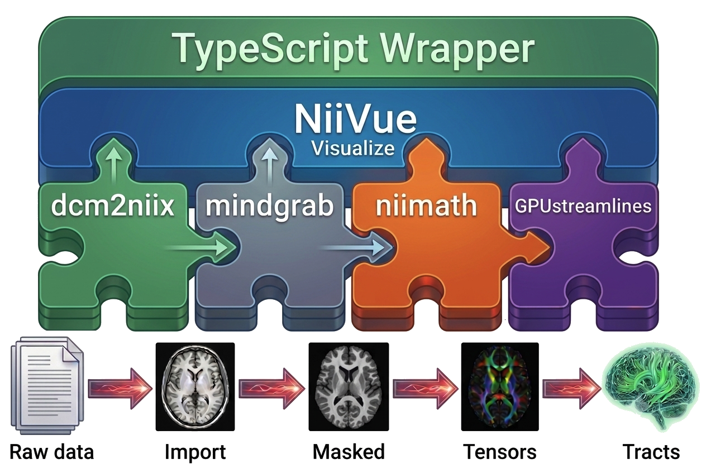

# Web Apps

Many of the tools we build are compact, robust, and modular. Combined in a thin browser-based interface, they make capable neuroimaging workflows available without a desktop installation or a remote compute service.

These applications run locally in the browser using WebAssembly and, where useful, WebGPU. Your data stays on your device: the computation uses your own CPU and graphics hardware rather than uploading sensitive images to a server.

## Built from interoperable pieces

Small, focused tools can be combined into workflows that are easier to inspect, adapt, and deploy. The dwi2trx pipeline illustrates that approach: a lightweight wrapper connects proven tools for conversion, brain extraction, image processing, visualization, and tractography.

<button class="webapps-modularity" type="button" data-lightbox-src="dwi2trx-transparent.png" data-lightbox-alt="A modular browser-based diffusion MRI workflow from raw data to tractography" aria-label="Enlarge the modular dwi2trx workflow illustration">
  
  Composable tools, one local workflow · click to enlarge
</button>

## Explore the apps

Tools from our team and others that showcase how our building blocks can be combined for a wide range of uses.

- [brain2print](https://brain2print.org/): Segment NIfTI images and create printable 3D brain meshes in the browser.
  _ITK-Wasm / niimath / NiiVue_
- [brainchop](https://brainchop.org/): AI-powered brain segmentation that runs on local images in the browser.
  _brainchop / NiiVue_
- [browserQC](https://browserqc.org/): Review neuroimaging data and support quality-control decisions in the browser.
  _brainchop / dcm2niix / niimath / NiiVue_
- [CALMaR](https://calmar.neurodesk.org/): Automated stroke-lesion mapping, connectivity analysis, and reporting.
  _NiiVue_
- [Deface](https://niivue.github.io/deface/): Remove facial features from structural images before sharing.
  _brainchop / niimath / NiiVue_
- [dicompare](https://dicompare.neurodesk.org/): Compare, validate, and share DICOM acquisition protocols across sites.
  _none listed_
- [dwi2trx](https://tee-ar-ex.github.io/dwi2trx/): Prepare diffusion MRI tractography for interactive exploration and 3D output.
  _brainchop / dcm2niix / GPUstreamlines / niimath ? NiiVue_
- [Easy MP2RAGE T1 Map](https://thomshaw92.github.io/Easy-MP2RAGE-T1-Map/): Create quantitative T1 maps from MP2RAGE acquisitions.
  _NiiVue_
- [EdgeReg](https://www.edgereg.org/): Perform local rigid and affine MRI registration directly in your browser.
  _brainchop / niimath / NiiVue_
- [MuscleMap](https://musclemap.neurodesk.org/): Segment and review whole-body or regional muscle MRI data.
  _NiiVue_
- [NeurodeskEDU](https://neurodesk.org/edu/examples/functional_imaging/AFNI_preprocessing_only.html): Learn reproducible AFNI functional-imaging preprocessing through an interactive example.
  _NiiVue_
- [niimath](https://niivue.github.io/niivue-niimath/): Run compact image-processing commands with an interactive local viewer.
  _niimath / NiiVue_
- [niiNav](https://niivue.github.io/niinav/): Explore neuroimaging volumes and surfaces with a lightweight web viewer.
  _NiiVue_
- [qMRust](https://qmrlab.org/qmrust/app/): Use quantitative MRI methods from qMRLab in a browser-native app.
  _NiiVue_
- [QSMbly](https://qsmbly.neurodesk.org/): Run a guided quantitative susceptibility mapping workflow from DICOM or NIfTI data.
  _NiiVue / QSM-WASM_
- [SeedSeg](https://seedseg.neurodesk.org/): Segment intraprostatic gold fiducial markers in prostate MRI.
  _NiiVue_
- [Spinal Cord Toolbox](https://sct.neurodesk.org/): Use browser-based spinal cord MRI segmentation workflows.
  _NiiVue_
- [VesselBoost](https://vesselboost.neurodesk.org/): Segment blood vessels from MRI angiography with guided local inference.
  _NiiVue_

## Core building blocks

These reusable modules provide the capabilities leveraged by the web apps.

- [brainchop](https://github.com/neuroneural/brainchop) For brain extraction, segmentation and parcelation.
- [dcm2niix](https://github.com/rordenlab/dcm2niix) DICOM to NIfTI image conversion.
- [GPUstreamlines](https://github.com/dipy/GPUStreamlines) Converts voxels to tracts.
- [ITK-Wasm](https://github.com/InsightSoftwareConsortium/itk-wasm) Provides access to this legendary image processing library.
- [niimath](https://github.com/rordenlab/niimath) High performance image processing.
- [NiiVue](https://github.com/niivue/niivue) Visualization of voxels, meshes, connectomes and streamlines.
- [QSM-WASM](https://github.com/astewartau/qsmbly/blob/main/rust-wasm/src/lib.rs) Quantifies of susceptibility weighted imaging.

## References

- [brain2print](https://pubmed.ncbi.nlm.nih.gov/40325035/) is described as a browser-based workflow for preparing neuroimaging data for 3D printing.
- Masoud et al. [(2023)](https://joss.theoj.org/papers/10.21105/joss.05098) describe Brainchop, an in-browser MRI segmentation and rendering application.
- [niimath](https://pubmed.ncbi.nlm.nih.gov/39268148/) provides compact, high-performance neuroimaging image processing.
- Dörig et al. [(2026)](https://apertureneuro.org/article/160858-developing-an-interactive-neuroimaging-education-resource-with-neurodesk) describe NeurodeskEDU, an interactive and reproducible neuroimaging education resource.
